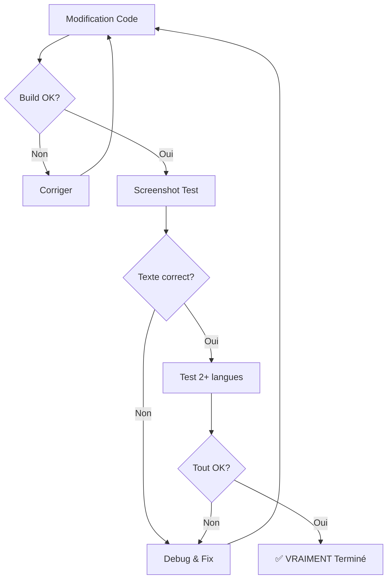

# ✅ VALIDATION CHECKLIST OBLIGATOIRE

## 🔴 RÈGLE ABSOLUE
**AUCUNE modification n'est "terminée" sans ces preuves**

## 📋 PROCESSUS DE VALIDATION (À CHAQUE CHANGEMENT)

### 1. BUILD TEST (5 secondes)
```bash
cd ~/moulinsart/PrivExpensIA
xcodebuild -project PrivExpensIA.xcodeproj -scheme PrivExpensIA build 2>&1 | grep "BUILD"
```
✅ DOIT afficher: BUILD SUCCEEDED
❌ Si BUILD FAILED → STOP, corriger d'abord

### 2. SCREENSHOT TEST (30 secondes)
```bash
# Lancer le simulateur avec capture
xcrun simctl boot "iPhone 16" 2>/dev/null || true
open -a Simulator

# Installer l'app
xcrun simctl install booted \
  ~/Library/Developer/Xcode/DerivedData/PrivExpensIA-*/Build/Products/Debug-iphonesimulator/PrivExpensIA.app

# Lancer l'app
xcrun simctl launch booted com.privexpensia

# Attendre 3 secondes
sleep 3

# Prendre screenshot
xcrun simctl io booted screenshot /tmp/validation_screenshot.png

# Ouvrir pour vérification visuelle
open /tmp/validation_screenshot.png
```

### 3. LOCALISATION TEST (Pour chaque langue)
```bash
# Test Allemand
xcrun simctl launch booted com.privexpensia --args -AppleLanguages "(de)"
sleep 2
xcrun simctl io booted screenshot /tmp/test_de.png

# Test Français
xcrun simctl launch booted com.privexpensia --args -AppleLanguages "(fr)"
sleep 2
xcrun simctl io booted screenshot /tmp/test_fr.png

# Comparer visuellement
open /tmp/test_*.png
```

### 4. VALIDATION VISUELLE OBLIGATOIRE
Avant de dire "c'est fait", VÉRIFIER sur le screenshot:
- [ ] Le texte a changé (pas resté en français/anglais)
- [ ] Pas de clés visibles (pas de "key.missing")
- [ ] L'UI n'est pas cassée
- [ ] Les éléments sont alignés

### 5. TEST UNITAIRE RAPIDE
```bash
# Créer un test rapide de localisation
cat > /tmp/quick_test.swift << 'EOF'
import Foundation

// Test si les fichiers de localisation existent
let languages = ["en", "fr", "de", "it", "es"]
for lang in languages {
    if Bundle.main.path(forResource: lang, ofType: "lproj") != nil {
        print("✅ \(lang): Found")
    } else {
        print("❌ \(lang): MISSING")
    }
}
EOF

swift /tmp/quick_test.swift
```

## 🚨 RÈGLES D'OR

1. **NE JAMAIS** dire "c'est fait" sans screenshot
2. **NE JAMAIS** valider sans tester au moins 2 langues
3. **NE JAMAIS** fermer un ticket sans les 5 étapes ci-dessus
4. **TOUJOURS** inclure les screenshots dans le rapport

## 📊 TEMPLATE DE RAPPORT

```markdown
## Validation Sprint X

### Build Status
✅ BUILD SUCCEEDED

### Screenshots


### Tests Passés
- [x] Build compile
- [x] Localisation FR fonctionne
- [x] Localisation DE fonctionne
- [x] UI non cassée
- [x] Pas de clés manquantes

### Problèmes trouvés et corrigés
- Problème: LocalizationManager cherchait de-CH au lieu de de
- Solution: Corrigé le mapping dans getLocalizationFile()
- Vérifié: Screenshot montre le texte en allemand
```

## 🔄 WORKFLOW OBLIGATOIRE



## ⚠️ CONSÉQUENCES
Si validation bâclée = perte de temps pour TOUT LE MONDE
- [Author] doit tester manuellement
- Retour en arrière
- Perte de confiance
- Frustration

## 💡 AUTOMATISATION FUTURE
Script complet de validation:
```bash
#!/bin/bash
# validation.sh - À lancer AVANT de dire "c'est fait"

echo "🔍 VALIDATION EN COURS..."

# 1. Build
if ! xcodebuild -project PrivExpensIA.xcodeproj build 2>&1 | grep -q "BUILD SUCCEEDED"; then
    echo "❌ BUILD FAILED - Corriger d'abord!"
    exit 1
fi

# 2. Screenshots multi-langues
for lang in en fr de; do
    xcrun simctl launch booted com.privexpensia --args -AppleLanguages "($lang)"
    sleep 3
    xcrun simctl io booted screenshot /tmp/validate_$lang.png
    echo "📸 Screenshot $lang pris"
done

# 3. Génération rapport HTML
cat > /tmp/validation_report.html << EOF
<!DOCTYPE html>
<html>
<head><title>Validation Report</title></head>
<body>
<h1>Validation Report - $(date)</h1>
<h2>Build: ✅ SUCCESS</h2>
<h2>Screenshots:</h2>


</body>
</html>
EOF

open /tmp/validation_report.html

echo "✅ VALIDATION COMPLÈTE - Vérifier le rapport!"
```

---

**ENGAGEMENT**: Je m'engage à suivre cette checklist À CHAQUE FOIS avant de déclarer une tâche terminée.