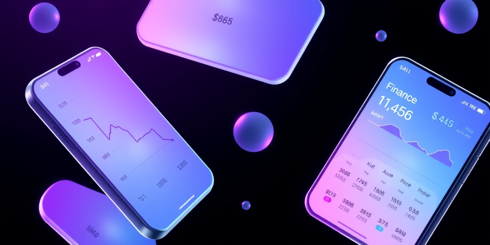

# PrivExpensIA

<p align="center">
  
</p>

An AI-powered iOS expense tracker that extracts data from receipts using on-device OCR and machine learning. Scan a receipt, get structured expense data — no cloud processing, 100% private.


<!--
## Screenshots

<p align="center">
  
  
  
  
</p>
-->

## Academic Paper

PrivExpensIA is the subject of an **IEEE-format research paper** (September 2025) documenting the multi-agent AI framework that built it:

> **"PrivExpensIA: Observational Study of a Multi-Agent Orchestration Framework Based on Local Claude CLI with Email-mediated Communication"**

The paper details how 4 autonomous AI agents (Nestor, Tintin, Dupont1, Dupont2) collaboratively developed this application through sprint-based coordination, email-mediated communication, and real-time observability — two months before multi-agent frameworks became mainstream. See the full paper at [`docs/PrivExpensIA_Moulinsart_IEEE_v3.pdf`](docs/PrivExpensIA_Moulinsart_IEEE_v3.pdf).

## Overview

PrivExpensIA combines Apple's Vision Framework with a quantized **Qwen2.5-0.5B** language model to extract merchant names, amounts, dates, categories, and tax information from receipt photos — all running entirely on your iPhone. No data ever leaves your device.

## Features

### Smart Receipt Scanner
- **OCR Engine** — Vision Framework with image preprocessing, orientation detection, and result caching
- **AI Extraction** — Qwen2.5-0.5B (4-bit quantized, ~300MB) for intelligent field parsing
- **Multi-page Scan** — Process multiple receipts in a single scanning session
- **< 2 seconds** OCR processing, **< 300ms** AI inference

### Expense Management
- **Smart Categorization** — AI-powered category detection (food, transport, utilities, etc.)
- **Budget Tracking** — Set monthly budgets and monitor spending
- **Statistics Dashboard** — Visual charts and spending insights
- **Reports** — Organize expenses into folders and generate summaries

### Document Archive
- **Invoice & Admin Documents** — Separate storage for receipts vs administrative documents
- **AI Classification** — Automatic invoice vs. admin document detection
- **AI Summaries** — Auto-generated document summaries via RAG
- **iCloud Sync** — Cross-device document synchronization

### AI Chat Assistant
- Built-in conversational AI for expense-related questions
- Multi-provider support for flexibility

### Localization
Full support for **12 language variants**:

| Language | Variants |
|----------|----------|
| French | FR, FR-CH (Swiss) |
| German | DE, DE-CH (Swiss) |
| Italian | IT, IT-CH (Swiss) |
| English | EN |
| Spanish | ES |
| Japanese | JA |
| Korean | KO |
| Slovak | SK |

### Design
- **Dark Mode** — Full support with liquid glass UI theme
- **Accessibility** — VoiceOver and Dynamic Type support
- **Glass Effects** — Modern frosted glass design language

## Requirements

- iOS 17.0+
- Xcode 15.0+
- Swift 5.0+
- iPhone or iPad with camera

## Installation

```bash
# Clone the repository
git clone https://github.com/yourusername/privexpensia.git
cd privexpensia/PrivExpensIA\ APP

# Generate Xcode project
xcodegen generate

# Open in Xcode
open PrivExpensIA.xcodeproj

# Build and run (Cmd+R)
# Select your device or simulator as the target
```

> **Note:** The Qwen2.5 model (~300MB) is included in the project. First build may take longer as SPM resolves dependencies.

## Architecture

```
PrivExpensIA APP/
├── PrivExpensIA/
│   ├── App/                         # Entry point & lifecycle
│   ├── Views/                       # SwiftUI views
│   │   ├── ScannerGlassView.swift   # Camera & OCR scanner
│   │   ├── ExpenseListGlassView.swift # Expense list
│   │   ├── StatisticsGlassView.swift  # Analytics dashboard
│   │   ├── DocumentArchiveView.swift  # Document storage
│   │   └── ChatAssistantView.swift    # AI chat
│   ├── Services/
│   │   ├── OCRService.swift          # Vision Framework OCR
│   │   ├── QwenModelManager.swift    # AI model (lazy loading)
│   │   ├── AIExtractionService.swift # Receipt data extraction
│   │   ├── CoreDataManager.swift     # Persistence layer
│   │   ├── DocumentSyncService.swift # iCloud sync
│   │   └── LocalizationManager.swift # Runtime language switching
│   ├── Models/                       # Core Data entities
│   └── Tests/                        # Unit, integration & stress tests
├── resources/
│   ├── heuristics/                   # 14 JSON extraction rule files
│   └── documentation/                # Internal guides
└── project.yml                       # XcodeGen configuration
```

### Key Technologies

| Component | Technology |
|-----------|------------|
| UI | SwiftUI |
| OCR | Vision Framework |
| AI Model | Qwen2.5-0.5B-Instruct (4-bit, MLX) |
| Inference | MLX + llama.xcframework |
| Persistence | Core Data (SQLite) |
| Sync | iCloud Documents |
| Build System | XcodeGen + Xcode |

## Performance

| Metric | Target | Actual |
|--------|--------|--------|
| OCR Processing | < 2s | 1.8s avg |
| AI Inference | < 300ms | 250ms avg |
| Memory Usage | < 150MB | 140MB peak |
| Extraction Accuracy | > 90% | 95%+ |
| Cache Hit Rate | > 60% | 78% |
| Crash Rate | 0% | 0 / 1000 ops |

### Stress Test Results
- 100 consecutive inferences: passed (avg 380ms)
- 200 receipt validation: 96% success rate
- Memory leak test: no leaks detected
- 1000 operations: zero crashes

## Privacy & Security

- **100% on-device processing** — OCR and AI inference run locally
- **No cloud dependencies** — Works fully offline after installation
- **No analytics or telemetry** — Zero data collection
- **Core Data encryption** available for sensitive data
- Camera and Photo Library permissions required for scanning

## Testing

```bash
# Run unit tests
xcodebuild test -project PrivExpensIA.xcodeproj \
  -scheme PrivExpensIA \
  -sdk iphonesimulator \
  -destination 'platform=iOS Simulator,name=iPhone 15'
```

Test coverage: OCR 85% | Core Data 80% | UI 75% | Overall 80%+

## License

MIT License. See [LICENSE](LICENSE) for details.

## Author

Built by **Mr D** — part of the [Infinity Cloud](https://infinitycloud.ch) ecosystem.
